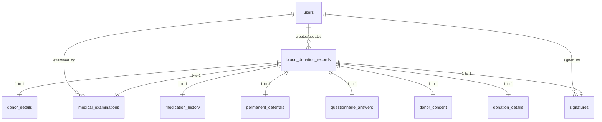

# Jankalyan Blood Bank System - Database Documentation

## Overview

This database manages digitalized blood donation records, donor demographics, medical screening assessments, blood collection details, digital signatures, system settings, user accounts, and security audit logs for the **Jankalyan Blood Centre & Hospital (Form QF/JKRP/18)**.

- **Database Engine:** SQLite 3
- **Database File:** [`database/bloodbank.db`](file:///d:/Jankalyaan_Digitalized_Form/database/bloodbank.db)
- **Schema Definition:** [`database/schema.sql`](file:///d:/Jankalyaan_Digitalized_Form/database/schema.sql)
- **Initialization & Seeding Script:** [`database/db_init.py`](file:///d:/Jankalyaan_Digitalized_Form/database/db_init.py)

---

## Entity Relationship Overview

The core of the database centers around the `blood_donation_records` master table. Each donation record acts as a parent container with 1-to-1 extension tables storing specific aspects of the donation process.



---

## Tables & Schema Specifications

### 1. `users`
Stores system accounts, roles, credentials, and medical registration info.

| Column | Type | Constraints | Description |
| :--- | :--- | :--- | :--- |
| `id` | INTEGER | PRIMARY KEY AUTOINCREMENT | Unique user identifier |
| `username` | TEXT | UNIQUE, NOT NULL | Account login username |
| `password_hash` | TEXT | NOT NULL | Werkzeug hashed password |
| `full_name` | TEXT | NOT NULL | User's complete display name |
| `role` | TEXT | CHECK (`ADMIN`, `STAFF`, `MEDICAL_OFFICER`) | Role assignment for RBAC |
| `medical_reg_no` | TEXT | Optional | Medical registration ID (for Doctors) |
| `signature_data` | TEXT | Optional | Base64 PNG signature string |
| `created_at` | TIMESTAMP | DEFAULT CURRENT_TIMESTAMP | User creation timestamp |

*Default Seeded Accounts:*
- `admin` (Role: `ADMIN`)
- `staff` (Role: `STAFF`)
- `doctor` (Role: `MEDICAL_OFFICER`)

---

### 2. `blood_donation_records`
Master record tracking each blood donation process and status lifecycle.

| Column | Type | Constraints | Description |
| :--- | :--- | :--- | :--- |
| `id` | INTEGER | PRIMARY KEY AUTOINCREMENT | Master record ID |
| `record_number` | TEXT | UNIQUE, NOT NULL | Form number (e.g. `BB-2026-000001`) |
| `donor_number` | TEXT | Optional | Unique donor identification number |
| `donation_date` | DATE | NOT NULL | Date of donation |
| `status` | TEXT | CHECK (`DRAFT`, `SUBMITTED`, `MEDICAL_VERIFICATION`, `SIGNED`, `COMPLETED`, `CANCELLED`) | Lifecycle status |
| `created_by` | INTEGER | FOREIGN KEY -> `users(id)` | User who created the form |
| `created_at` | TIMESTAMP | DEFAULT CURRENT_TIMESTAMP | Creation timestamp |
| `updated_by` | INTEGER | FOREIGN KEY -> `users(id)` | User who last updated |
| `updated_at` | TIMESTAMP | DEFAULT CURRENT_TIMESTAMP | Last update timestamp |

---

### 3. `donor_details`
Personal and demographic information of the donor.

| Column | Type | Description |
| :--- | :--- | :--- |
| `id` | INTEGER PRIMARY KEY | Identifier |
| `record_id` | INTEGER UNIQUE (FK) | Reference to `blood_donation_records(id)` |
| `full_name` | TEXT NOT NULL | Full name of donor |
| `gender` | TEXT NOT NULL | Male / Female / Other |
| `date_of_birth` | DATE | Birth date |
| `age` | INTEGER NOT NULL | Age in years |
| `occupation` | TEXT | Occupation |
| `organization_company` | TEXT | Company/Organization |
| `residential_address` | TEXT NOT NULL | Address details |
| `city_district` | TEXT NOT NULL | City/District |
| `pincode` | TEXT | Pincode |
| `mobile_number` | TEXT NOT NULL | Contact phone number |
| `email` | TEXT | Email address |
| `blood_group_known` | TEXT | Known blood group (e.g., A+, O+, B-) |
| `donation_type` | TEXT NOT NULL | Voluntary / Replacement / Camp |
| `last_donation_date` | DATE | Previous donation date |
| `number_of_past_donations` | INTEGER DEFAULT 0 | Count of past donations |

---

### 4. `medical_examinations`
Vitals measurement and medical officer pre-donation screening.

| Column | Type | Description |
| :--- | :--- | :--- |
| `id` | INTEGER PRIMARY KEY | Identifier |
| `record_id` | INTEGER UNIQUE (FK) | Reference to `blood_donation_records(id)` |
| `weight_kg` | REAL NOT NULL | Donor weight in kg (min 45 kg) |
| `height_cm` | REAL | Donor height in cm |
| `pulse_rate` | INTEGER NOT NULL | Heart rate (bpm) |
| `bp_systolic` | INTEGER NOT NULL | Systolic Blood Pressure (mmHg) |
| `bp_diastolic` | INTEGER NOT NULL | Diastolic Blood Pressure (mmHg) |
| `hemoglobin_g_dl` | REAL NOT NULL | Hemoglobin level in g/dL (min 12.5) |
| `body_temperature` | REAL NOT NULL | Body temperature (°F) |
| `skin_site_inspection` | TEXT NOT NULL | Inspection of phlebotomy site |
| `screening_outcome` | TEXT CHECK (`ELIGIBLE`, `DEFERRED`, `REJECTED`) | Result |
| `deferral_reason` | TEXT | Deferral reason description |
| `deferral_duration` | TEXT | Temporary deferral time |
| `examined_by_staff_id` | INTEGER (FK) | Staff/Doctor who performed vitals check |

---

### 5. `medication_history`
| Column | Type | Description |
| :--- | :--- | :--- |
| `id` | INTEGER PRIMARY KEY | Identifier |
| `record_id` | INTEGER UNIQUE (FK) | Reference to `blood_donation_records(id)` |
| `answers_json` | TEXT NOT NULL | JSON string storing medication history Q&A |

---

### 6. `permanent_deferrals`
| Column | Type | Description |
| :--- | :--- | :--- |
| `id` | INTEGER PRIMARY KEY | Identifier |
| `record_id` | INTEGER UNIQUE (FK) | Reference to `blood_donation_records(id)` |
| `conditions_json` | TEXT NOT NULL | JSON array storing selected permanent deferral conditions |

---

### 7. `questionnaire_answers`
| Column | Type | Description |
| :--- | :--- | :--- |
| `id` | INTEGER PRIMARY KEY | Identifier |
| `record_id` | INTEGER UNIQUE (FK) | Reference to `blood_donation_records(id)` |
| `answers_json` | TEXT NOT NULL | JSON object storing responses to health questionnaire |

---

### 8. `donor_consent`
| Column | Type | Description |
| :--- | :--- | :--- |
| `id` | INTEGER PRIMARY KEY | Identifier |
| `record_id` | INTEGER UNIQUE (FK) | Reference to `blood_donation_records(id)` |
| `consent_given` | INTEGER DEFAULT 1 | Consent checkbox marker (1 = True) |
| `abnormal_results_notify` | INTEGER DEFAULT 1 | Consent to be notified of abnormal test results |
| `donor_signature_data` | TEXT | Base64 PNG donor signature |
| `consent_timestamp` | TIMESTAMP | Timestamp when consent was captured |

---

### 9. `donation_details`
Blood bag, phlebotomy, and collection outcome details.

| Column | Type | Description |
| :--- | :--- | :--- |
| `id` | INTEGER PRIMARY KEY | Identifier |
| `record_id` | INTEGER UNIQUE (FK) | Reference to `blood_donation_records(id)` |
| `blood_bag_number` | TEXT NOT NULL | Barcode / Blood Bag Number |
| `bag_type` | TEXT NOT NULL | Single / Double / Triple / Quadruple |
| `anticoagulant` | TEXT NOT NULL | Anticoagulant solution (e.g. CPDA-1, SAGM) |
| `volume_ml` | INTEGER NOT NULL | Collected volume in ml (e.g., 350ml / 450ml) |
| `segment_number` | TEXT | Tubing segment ID |
| `phlebotomy_site` | TEXT | Left Arm / Right Arm |
| `phlebotomist_staff_id` | TEXT | Name or ID of phlebotomist |
| `donation_status` | TEXT | Status (`SUCCESSFUL`, `INCOMPLETE`, `FAILED`) |
| `adverse_reaction` | TEXT | Reaction status (`NONE`, `HEMATOMA`, `FAINTING`, etc.) |
| `reaction_details` | TEXT | Additional notes on adverse events |

---

### 10. `signatures`
Medical Officer approval and verification signatures.

| Column | Type | Description |
| :--- | :--- | :--- |
| `id` | INTEGER PRIMARY KEY | Identifier |
| `record_id` | INTEGER UNIQUE (FK) | Reference to `blood_donation_records(id)` |
| `user_id` | INTEGER (FK) | Reference to `users(id)` |
| `user_name` | TEXT NOT NULL | Doctor full name |
| `user_role` | TEXT NOT NULL | `MEDICAL_OFFICER` |
| `signature_data` | TEXT NOT NULL | Base64 PNG signature string |
| `medical_notes` | TEXT | Verification and approval comments |
| `signed_at` | TIMESTAMP | Sign-off timestamp |

---

### 11. `system_settings`
Global system configuration key-value pairs.

| Column | Type | Description |
| :--- | :--- | :--- |
| `setting_key` | TEXT PRIMARY KEY | Setting key name (e.g., `record_prefix`, `hospital_name`) |
| `setting_value` | TEXT NOT NULL | Setting value |

---

### 12. `audit_logs`
Tracks security events, user logins, and record mutations.

| Column | Type | Description |
| :--- | :--- | :--- |
| `id` | INTEGER PRIMARY KEY | Identifier |
| `user_id` | INTEGER | User ID associated with event |
| `username` | TEXT NOT NULL | Username performing action |
| `record_id` | INTEGER | Related record ID (if applicable) |
| `record_number` | TEXT | Related record number |
| `action` | TEXT NOT NULL | Action type (e.g. `LOGIN`, `RECORD_CREATE`, `RECORD_SIGN`) |
| `details` | TEXT | Text description / metadata |
| `ip_address` | TEXT | Client IP address |
| `timestamp` | TIMESTAMP | Event timestamp |

---

## How to View and Query Database Records

You can inspect and query all records in the database using any of the following methods:

### Method 1: Via Web Application UI & API
1. Start the Flask application:
   ```bash
   python app.py
   ```
2. Open your browser and navigate to:
   - **Dashboard (All Donation Records):** `http://localhost:5000/dashboard.html`
   - **User Management (Admin Only):** `http://localhost:5000/users.html`
   - **Excel Export:** Go to Dashboard and click **"Export Excel"** or open `http://localhost:5000/api/export/excel` directly.
   - **JSON API Endpoints:**
     - All records: `GET http://localhost:5000/api/records`
     - Audit logs: `GET http://localhost:5000/api/audit-logs`
     - Users list: `GET http://localhost:5000/api/users`

### Method 2: Via Python Script
Run a Python snippet in your terminal or script:
```python
import sqlite3

conn = sqlite3.connect('database/bloodbank.db')
conn.row_factory = sqlite3.Row
cursor = conn.cursor()

# Query all records joined with donor details
cursor.execute('''
    SELECT r.id, r.record_number, r.donation_date, r.status, d.full_name, d.mobile_number, d.blood_group_known
    FROM blood_donation_records r
    LEFT JOIN donor_details d ON r.id = d.record_id
''')

for row in cursor.fetchall():
    print(dict(row))

conn.close()
```

### Method 3: Via SQLite Command Line Interface (CLI)
Open a terminal in the project directory:
```bash
sqlite3 database/bloodbank.db
```
Then execute SQL commands:
```sql
.headers on
.mode column

-- View total row count for all tables
SELECT 'users', COUNT(*) FROM users
UNION ALL SELECT 'blood_donation_records', COUNT(*) FROM blood_donation_records
UNION ALL SELECT 'donor_details', COUNT(*) FROM donor_details
UNION ALL SELECT 'audit_logs', COUNT(*) FROM audit_logs;

-- Select all records
SELECT * FROM blood_donation_records;

-- Exit SQLite CLI
.exit
```

### Method 4: Via GUI Tools (e.g. DB Browser for SQLite)
1. Download & Install [DB Browser for SQLite](https://sqlitebrowser.org/).
2. Click **Open Database** and select `d:\Jankalyaan_Digitalized_Form\database\bloodbank.db`.
3. Use the **Browse Data** tab to view, search, and filter records in any table.

---

## Database Management Commands

- **Re-initialize / Reset Database:**
  ```bash
  python database/db_init.py
  ```
- **Backup Database via API:**
  Navigate to Admin panel or fetch `GET http://localhost:5000/api/backup/download`.
